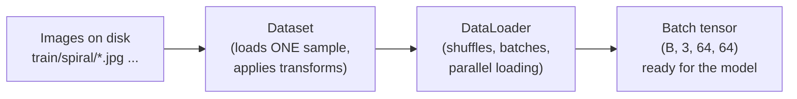

# 08 — PyTorch Data Pipelines (Datasets & DataLoaders)

> A model is only as good as the data you feed it, and *how* you feed it matters enormously. PyTorch has a clean, three-layer system for getting folders of galaxy images onto the GPU efficiently: **transforms**, **`Dataset`**, and **`DataLoader`**. Master this and you've mastered the least glamorous but most important skill in applied deep learning.

---

## The Big Picture

You have a folder of JPG galaxy images on disk. Your model wants batches of normalised tensors on the GPU. Three PyTorch abstractions bridge that gap:



- **`transforms`** — the per-image recipe: resize, convert to tensor, normalise.
- **`Dataset`** — knows how to fetch and transform *one* sample given an index.
- **`DataLoader`** — wraps a `Dataset` to yield *shuffled batches*, loading them in parallel so the GPU never waits.

We'll build them in that order.

---

## Layer 1 — `torchvision.transforms`

A raw JPG is the wrong size, the wrong type (it's a PIL image, not a tensor), and the wrong scale (pixel values 0–255). Transforms fix all three. You compose them into a pipeline:

```python
from torchvision import transforms

transform = transforms.Compose([
    transforms.Resize((64, 64)),          # make every image 64x64
    transforms.ToTensor(),                # PIL image -> tensor, and scale 0-255 -> 0.0-1.0
    transforms.Normalize(                 # standardise each channel
        mean=[0.5, 0.5, 0.5],
        std=[0.5, 0.5, 0.5],
    ),
])
```

### What each transform does

| Transform | Effect | Why |
|---|---|---|
| `Resize((64, 64))` | Forces a fixed spatial size. | Models need consistent input shapes; 64×64 is fast on Colab. |
| `ToTensor()` | Converts a PIL/NumPy image to a `(C, H, W)` float tensor and rescales `0–255 → 0.0–1.0`. | PyTorch works in channels-first floats. |
| `Normalize(mean, std)` | `pixel = (pixel - mean) / std`, per channel. | Centred, unit-ish-scale inputs train faster and more stably. |

> **Order matters.** `ToTensor()` must come before `Normalize()` (you can't normalise a PIL image), and `Resize` typically comes first so later steps work on a known size.

### Why normalise?

Neural networks train best when inputs are roughly centred at 0 with a similar scale across features. Feeding raw `0–255` values makes the optimisation landscape lopsided and slows learning. With `mean=std=0.5`, `ToTensor`'s `0–1` range is mapped to roughly `−1 to +1`.

> In a more careful pipeline you'd compute the *actual* per-channel mean and std of the galaxy training set and use those. Using `0.5` is a fine, simple starting point for Week 1; we may revisit it later.

### A glimpse of augmentation (preview)

Because a galaxy looks like a galaxy at any rotation or flip, we can *manufacture* extra training data with random transforms:

```python
train_transform = transforms.Compose([
    transforms.Resize((64, 64)),
    transforms.RandomHorizontalFlip(),
    transforms.RandomRotation(180),       # galaxies have no "up"
    transforms.ToTensor(),
    transforms.Normalize([0.5]*3, [0.5]*3),
])
```

Crucially, **augmentation is applied only to the training set**, never to validation/test data (you want to evaluate on untouched images). We'll lean on this more when overfitting becomes a concern.

---

## Layer 2 — `Dataset` (via `ImageFolder`)

A PyTorch `Dataset` is any object implementing two methods: `__len__` (how many samples) and `__getitem__(i)` (fetch sample `i`). You *can* write one by hand, but for images sorted into class folders, `torchvision` gives you one for free.

### Our Galaxy Zoo 2 download is **not** ImageFolder-ready out of the box

The [Kaggle Galaxy Zoo 2 mirror](https://www.kaggle.com/datasets/jaimetrickz/galaxy-zoo-2-images) we use ships:

```
galaxy_raw/
├── gz2_filename_mapping.csv   # objid ↔ asset_id
├── images_gz2/                # flat folder: 1.jpg, 2.jpg, …
│   ├── 1.jpg
│   ├── 2.jpg
│   └── ...
└── gz2_hart16.csv             # official morphology labels (download separately)
```

There are **no class subfolders** and **no label in the filename**. Labels live in catalogues:

| File | What it tells you |
|---|---|
| `gz2_filename_mapping.csv` | Which JPG (`asset_id`) belongs to which galaxy (`objid`). |
| `gz2_hart16.csv` | The debiased morphology code (`gz2_class`, e.g. `Sc2t`, `Ei`) for each `objid`. |

So the Week 1 data notebook **joins these CSVs first**, collapses `gz2_class` to a few high-level buckets (`elliptical`, `spiral`, `spiral_barred`, …), then symlinks a balanced subset into:

```
galaxy_data/
├── elliptical/    123.jpg -> ../../galaxy_raw/images_gz2/123.jpg
├── spiral/        ...
└── spiral_barred/ ...
```

Only after that step does `ImageFolder` apply. Real surveys often ship flat archives + tables — learning to join them is part of the job.

#### Step-by-step recipe (Week 1 notebook)

**1. Join the two CSVs**

```python
mapping = pd.read_csv("galaxy_raw/gz2_filename_mapping.csv")
labels = pd.read_csv("galaxy_raw/gz2_hart16.csv").rename(columns={"dr7objid": "objid"})
df = mapping.merge(labels[["objid", "gz2_class"]], on="objid", how="inner")
```

Each row now has `asset_id` (JPG filename), `objid`, and `gz2_class` (e.g. `Sc2t`, `Ei`).

**2. Collapse to high-level class names**

```python
def high_level_label(gz2_class):
    if not isinstance(gz2_class, str) or gz2_class == "A":
        return None
    if gz2_class.startswith("E"):  return "elliptical"
    if gz2_class.startswith("SB"): return "spiral_barred"
    if gz2_class.startswith("S"):  return "spiral"
    return None

df["label"] = df["gz2_class"].map(high_level_label)
df = df.dropna(subset=["label"])
```

**3. Symlink into train / val / test class folders**

For each label, take `PER_CLASS` galaxies, split 70% / 15% / 15%, and link files:

```
galaxy_data/train/elliptical/123.jpg  →  ../../galaxy_raw/images_gz2/123.jpg
galaxy_data/val/spiral/456.jpg      →  ...
galaxy_data/test/spiral_barred/789.jpg →  ...
```

**4. Point ImageFolder at each split**

```python
train_ds = ImageFolder("galaxy_data/train", transform=transform)
val_ds   = ImageFolder("galaxy_data/val",   transform=transform)
test_ds  = ImageFolder("galaxy_data/test",  transform=transform)
```

The full helper functions live in [`week1_data_solution.ipynb`](notebooks/week1_data_solution.ipynb) Steps 3–4. Copy them if you're stuck.

> **Alternative:** If you already have one big class-folder tree (no train/val/test yet), you can use `random_split` on a single `ImageFolder` — see below. For GZ2 we prefer splitting **before** symlinking so filenames never leak across splits.

### `ImageFolder`: the easy button

If your data is already laid out like this:

```
galaxy_data/
├── train/
│   ├── elliptical/   img001.jpg, img002.jpg, ...
│   ├── spiral/       img101.jpg, ...
│   └── irregular/    img201.jpg, ...
└── test/
    ├── elliptical/   ...
    ├── spiral/       ...
    └── irregular/    ...
```

…then `ImageFolder` infers the labels **from the folder names**, automatically:

```python
from torchvision.datasets import ImageFolder

train_ds = ImageFolder(root="galaxy_data/train", transform=transform)
test_ds  = ImageFolder(root="galaxy_data/test",  transform=transform)

print(len(train_ds))          # number of training images
print(train_ds.classes)       # ['elliptical', 'irregular', 'spiral'] (alphabetical)
print(train_ds.class_to_idx)  # {'elliptical': 0, 'irregular': 1, 'spiral': 2}

image, label = train_ds[0]    # one sample
print(image.shape, label)     # torch.Size([3, 64, 64]) 0
```

Three things to internalise:

1. **Classes are assigned alphabetically.** `elliptical → 0`, `irregular → 1`, `spiral → 2`. Always check `class_to_idx` so you can map predictions back to names later.
2. **Each item is a `(image_tensor, label_int)` tuple.** The transform you passed is applied lazily inside `__getitem__`.
3. **Nothing is loaded until you ask.** `ImageFolder` only scans filenames upfront; images are read from disk on demand.

### Train / validation / test splits

You'll usually want three splits:

- **Train** — the model learns from these.
- **Validation** — you tune and monitor on these (without training on them).
- **Test** — touched once, at the very end, for an honest final score.

If your data only ships `train/` and `test/`, carve a validation set out of train with `random_split`:

```python
from torch.utils.data import random_split
import torch

n_val = int(0.15 * len(train_ds))
n_train = len(train_ds) - n_val
train_subset, val_subset = random_split(
    train_ds, [n_train, n_val],
    generator=torch.Generator().manual_seed(42),  # reproducible split
)
```

> Always seed the split so your experiments are reproducible. A model whose results you can't reproduce is a model you can't trust.

---

## Layer 3 — `DataLoader`

A `Dataset` gives you one sample at a time. Training wants **batches**, **shuffling**, and **speed**. That's the `DataLoader`:

```python
from torch.utils.data import DataLoader

train_loader = DataLoader(
    train_subset,
    batch_size=32,      # 32 images per batch
    shuffle=True,       # reshuffle every epoch (train only!)
    num_workers=2,      # parallel data-loading processes
    pin_memory=True,    # faster host->GPU transfer
)

val_loader = DataLoader(val_subset, batch_size=32, shuffle=False)
test_loader = DataLoader(test_ds, batch_size=32, shuffle=False)
```

### Key arguments

| Argument | Meaning | Typical value |
|---|---|---|
| `batch_size` | How many samples per batch. | 32 / 64 / 128 |
| `shuffle` | Reshuffle order each epoch. | `True` for train, `False` for val/test |
| `num_workers` | Parallel loader subprocesses. | 2 on Colab |
| `pin_memory` | Pin host memory for faster GPU copy. | `True` when using GPU |
| `drop_last` | Drop a final undersized batch. | usually `False` |

### Iterating

A `DataLoader` is just an iterable that yields `(images, labels)` batches:

```python
for images, labels in train_loader:
    print(images.shape)   # torch.Size([32, 3, 64, 64])  -> (B, C, H, W)
    print(labels.shape)   # torch.Size([32])
    break                 # peek at one batch
```

That `(B, C, H, W)` tensor is **exactly** what every model we build from Week 2 onward will consume. The leading `B` is the batch dimension we previewed with `unsqueeze(0)` back in [`02-pytorch-tensors.md`](02-pytorch-tensors.md) — except now there are 32 real galaxies stacked, not one.

---

## Why Batches? Why Shuffle?

- **Batches** let the GPU process many images in parallel (its whole reason for existing — see [`03-gpu-acceleration.md`](03-gpu-acceleration.md)) and give smoother gradient estimates than one image at a time. They also keep memory bounded: you never load the whole dataset at once, so Colab doesn't run out of RAM.
- **Shuffling** prevents the model from learning the *order* of the data. If all ellipticals came first, the model would see only ellipticals for a while and learn something useless. Reshuffling every epoch breaks that correlation.

---

## Visualising a Batch

The single best sanity check before training anything: **look at your data**. Plot a batch straight from the loader.

```python
import matplotlib.pyplot as plt
import torchvision

images, labels = next(iter(train_loader))

# Undo the Normalize([0.5],[0.5]) so colours look right: x*std + mean
images_show = images * 0.5 + 0.5

grid = torchvision.utils.make_grid(images_show[:16], nrow=4)
plt.figure(figsize=(8, 8))
plt.imshow(grid.permute(1, 2, 0))   # (C,H,W) -> (H,W,C) for matplotlib
plt.axis("off")
plt.title("A batch of galaxies")
plt.show()
```

Two recurring gotchas live in those lines:

1. **You must undo normalisation before plotting**, or colours look washed out / clipped.
2. **matplotlib wants `(H, W, C)`** but PyTorch is `(C, H, W)`, hence `.permute(1, 2, 0)`.

If the images look like recognisable galaxies with sensible labels, your pipeline works. If they look like noise, debug *here* — long before you waste an hour training on garbage.

---

## Common Pitfalls

| Symptom | Cause | Fix |
|---|---|---|
| `ImageFolder` finds 0 images | Wrong `root`, or data is still in the flat Kaggle layout (no class subfolders yet). | Print the directory tree; join CSV labels and build `root/class/img.jpg` first (see above). |
| Plotted images look washed out | Forgot to undo `Normalize`. | Multiply by std, add mean before `imshow`. |
| `TypeError` in `imshow` | Passed `(C, H, W)` instead of `(H, W, C)`. | `.permute(1, 2, 0)` and `.cpu().numpy()` if needed. |
| `DataLoader` hangs on Colab | Too many `num_workers`. | Use `num_workers=2` (or `0` if it still hangs). |
| Labels don't match expectations | Forgot classes are alphabetical. | Inspect `class_to_idx`. |
| Validation accuracy suspiciously high | Augmentation/leak into val/test. | Augment train only; keep val/test transforms plain. |

---

## Quick Self-Check

1. What are the three layers of a PyTorch data pipeline, and what does each do?
2. Why must `ToTensor()` come before `Normalize()`?
3. What shape does a `DataLoader` batch have for 32 RGB 64×64 images?
4. Why do we shuffle the training set but not the test set?
5. You plot a batch and the colours look wrong. What's the most likely bug?

<details>
<summary>Answers</summary>

1. **transforms** (per-image recipe: resize/to-tensor/normalise), **Dataset** (fetch + transform one sample by index), **DataLoader** (shuffle + batch + parallel-load).
2. `Normalize` operates on tensors; `ToTensor` is what produces the tensor (and the 0–1 scaling) in the first place.
3. `(32, 3, 64, 64)` — `(B, C, H, W)`.
4. Shuffling train breaks order-based correlations and improves gradient estimates each epoch. Test must stay fixed so the evaluation is consistent and reproducible.
5. You forgot to undo the `Normalize` before `imshow` (and/or didn't `.permute(1, 2, 0)`).

</details>

---

## External Resources

- 📘 [PyTorch — Datasets & DataLoaders tutorial](https://docs.pytorch.org/tutorials/beginner/basics/data_tutorial.html) — the canonical walkthrough.
- 📘 [`torchvision.datasets.ImageFolder` docs](https://docs.pytorch.org/vision/stable/generated/torchvision.datasets.ImageFolder.html).
- 📘 [`torchvision.transforms` docs](https://docs.pytorch.org/vision/stable/transforms.html) — every available transform.
- 📘 [PyTorch — `DataLoader` API reference](https://docs.pytorch.org/docs/stable/data.html).
- 📘 [PyTorch — Writing custom datasets, dataloaders and transforms](https://docs.pytorch.org/tutorials/beginner/data_loading_tutorial.html) — for when `ImageFolder` isn't enough.
- 📺 [PyTorch DataLoaders explained — Patrick Loeber](https://www.youtube.com/watch?v=PXOzkkB5eH0).
- 📘 [A recipe for data normalisation in vision](https://docs.pytorch.org/vision/stable/models.html#general-information-on-pre-trained-weights) — how torchvision's own models normalise.

---

⬅️ Previous: [`07-photometry-and-filters.md`](07-photometry-and-filters.md) | ➡️ Next: [`09-project-task.md`](09-project-task.md)
