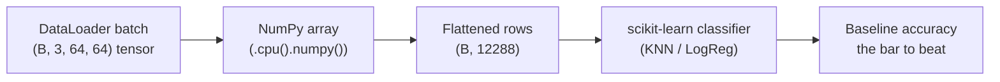

# 01 — From Tensors to NumPy, and the Great Flattening

> Before we build any neural network, we set a **baseline**: the simplest possible model, whose score every fancier model must beat. Traditional machine-learning tools (scikit-learn) don't speak PyTorch — they speak NumPy, and they expect each sample to be a flat row of numbers. This page is about the two small, slightly lossy translations that get our galaxy images ready for that world: **tensor → NumPy array** and **image → 1D vector**.

---

## Why Step Back to "Old-School" ML?

Last week you built a `DataLoader` that yields batches of galaxy images shaped `(B, 3, 64, 64)`. The obvious next move is "build the CNN!" — but resist it for one week. First we want a **yardstick**.

A baseline answers the question: *how hard is this problem, really?* If a dead-simple classifier on flattened pixels already gets 80%, then a CNN that gets 82% isn't impressive. If the simple classifier gets 45%, then a CNN at 75% is a genuine win. Without a baseline you have **no idea** whether your model is good — you just have a number floating in a vacuum.



Text fallback: `DataLoader batch → NumPy array → flattened rows → scikit-learn classifier → baseline accuracy`.

---

## Translation 1 — Tensor → NumPy

PyTorch tensors and NumPy arrays are close cousins. Both are n-dimensional grids of numbers; they even **share memory** when they can. Converting is one method call:

```python
import torch

t = torch.randn(3, 64, 64)   # a tensor on the CPU
arr = t.numpy()              # a NumPy array, SHARING the same memory
print(type(arr), arr.shape)  # <class 'numpy.ndarray'> (3, 64, 64)
```

That works only when the tensor is on the **CPU** and doesn't need gradients. Two gotchas show up constantly, and both have one-line fixes:

| Situation | Error you'll see | Fix |
|---|---|---|
| Tensor is on the GPU | `TypeError: can't convert cuda:0 device type tensor to numpy.` | `.cpu()` first: `t.cpu().numpy()`. |
| Tensor tracks gradients | `RuntimeError: ... requires grad ... use .detach()` | `.detach()` first: `t.detach().cpu().numpy()`. |

So the **safe, always-correct incantation** — memorise this — is:

```python
arr = t.detach().cpu().numpy()
```

`.detach()` drops the autograd history, `.cpu()` moves it off the GPU, `.numpy()` hands it to NumPy. For our baseline the data hasn't gone through any model yet, so `.detach()` is usually unnecessary — but it never hurts, and getting it into your fingers now saves debugging later.

> **Why does sklearn need NumPy at all?** Because scikit-learn predates the deep-learning tensor libraries and is built directly on NumPy. It has no concept of a GPU, autograd, or a `Tensor`. It wants a plain `(n_samples, n_features)` array of floats and a `(n_samples,)` array of labels. Nothing more.

---

## Translation 2 — Flattening an Image into a Vector

Here's the conceptual leap. A scikit-learn classifier expects each sample to be a **flat list of features**: a single row of numbers. But a galaxy image is a 3D block: 3 colour channels × 64 rows × 64 columns.

**Flattening** unrolls that block into one long 1D vector:

```
(3, 64, 64)  →  3 × 64 × 64  =  12 288 numbers in a row
```

```python
image = torch.randn(3, 64, 64)
flat = image.flatten()          # or image.reshape(-1)
print(flat.shape)               # torch.Size([12288])
```

For a whole batch you flatten **per sample**, keeping the batch dimension intact:

```python
batch = torch.randn(32, 3, 64, 64)      # (B, C, H, W)
flat_batch = batch.flatten(start_dim=1) # flatten everything AFTER dim 0
print(flat_batch.shape)                 # torch.Size([32, 12288])
```

`start_dim=1` is the key: it says "leave dimension 0 (the batch) alone, and flatten dimensions 1, 2, 3 into one." The result is exactly the `(n_samples, n_features)` matrix sklearn wants.

### A picture of what flattening does

Imagine reading a single channel of the image like a book — left to right, top to bottom — and writing every pixel value into one long line. Then do the same for the next channel, and the next, and concatenate. That's it.

```
row 0:  p00 p01 p02 ... p0,63
row 1:  p10 p11 p12 ... p1,63
...                               ──flatten──►  [p00 p01 ... p0,63 p10 p11 ... p63,63 | (channel 2) ... | (channel 3) ...]
row 63: p63,0 ...      p63,63
```

---

## The Catch: Flattening Throws Away Geometry

Flattening is convenient, but it is **lossy in a way that matters enormously for images**. The moment you unroll the grid, you destroy the information about *which pixel was next to which*.

Consider two pixels that are vertically adjacent in the image: pixel `(row=10, col=20)` and pixel `(row=11, col=20)`. In the image they touch. After flattening, they end up **64 positions apart** in the vector (one full row of width 64 between them). The classifier has no idea they were ever neighbours.

This is catastrophic for galaxy morphology, because **morphology is spatial**:

- A spiral arm is a *curve* — a relationship between nearby pixels.
- A bar is a *straight elongated structure* — again, a spatial pattern.
- A smooth elliptical light profile is about how brightness *falls off with distance from the centre*.

A flatten-and-classify model sees 12 288 independent numbers with no map telling it how they're arranged. It can still pick up *some* signal (ellipticals are smoother and redder; spirals have bluer, lumpier pixel distributions), which is why the baseline won't be terrible — but it is fundamentally blind to shape.

> **This is the whole motivation for CNNs.** A Convolutional Neural Network (Week 3) is precisely the architecture that *refuses* to flatten first — it processes the image while it's still a grid, so neighbouring pixels stay neighbours. Watching the baseline struggle here is what makes the CNN's later success meaningful. Keep this page in mind when you read Week 3.

### Another way to see the loss: shuffle the pixels

Here's a thought experiment. Take a galaxy image, and apply the *same* random permutation to the pixel order of every image in your dataset. To your eyes the images become unrecognisable noise. But a flatten-and-classify model achieves **exactly the same accuracy** as before — because to it, the pixels were never in any meaningful order anyway. A CNN's accuracy, by contrast, would collapse. That gap *is* the spatial information.

---

## Putting It Together (Preview of the Notebook)

The Part 1 notebook turns your Week-1 `DataLoader` into NumPy matrices like this:

```python
import numpy as np

def loader_to_numpy(loader):
    xs, ys = [], []
    for images, labels in loader:               # images: (B, 3, 64, 64)
        flat = images.flatten(start_dim=1)       # (B, 12288)
        xs.append(flat.numpy())
        ys.append(labels.numpy())
    X = np.concatenate(xs, axis=0)               # (N, 12288)
    y = np.concatenate(ys, axis=0)               # (N,)
    return X, y

X_train, y_train = loader_to_numpy(train_loader)
X_test,  y_test  = loader_to_numpy(test_loader)
print(X_train.shape, y_train.shape)              # (N_train, 12288) (N_train,)
```

`X_train` is now a giant 2D table: one row per galaxy, 12 288 columns per row. `y_train` is the matching list of integer class labels. That's the exact shape every scikit-learn classifier expects — which is what [`02-baseline-with-scikit-learn.md`](02-baseline-with-scikit-learn.md) does next.

---

## Quick Self-Check

1. What is the always-safe one-liner to turn a GPU tensor that tracks gradients into a NumPy array?
2. A batch is shaped `(64, 3, 32, 32)`. What does `batch.flatten(start_dim=1).shape` print, and why `start_dim=1`?
3. In one sentence, what spatial information does flattening destroy?
4. Why does a flatten-and-classify model give the *same* accuracy even if you consistently shuffle all pixel positions?
5. Why bother with a baseline at all instead of jumping straight to a CNN?

<details>
<summary>Answers</summary>

1. `t.detach().cpu().numpy()` — detach drops autograd history, cpu moves it off the GPU, numpy hands it over.
2. `torch.Size([64, 3072])` because `3 × 32 × 32 = 3072`. `start_dim=1` keeps the batch dimension (dim 0) intact and flattens only the per-image dimensions.
3. It destroys *adjacency* — which pixels were neighbours in the 2D grid — so the model can no longer reason about shapes like arms, bars, or smooth profiles.
4. Because it treats every pixel as an independent feature with no notion of position, so a fixed reordering of features is invisible to it.
5. A baseline tells you how hard the problem is and gives you a number to beat; without it you can't tell whether a later model's accuracy is good or bad.

</details>

---

## External Resources

- 📘 [PyTorch — `torch.Tensor.numpy()` docs](https://docs.pytorch.org/docs/stable/generated/torch.Tensor.numpy.html) and [bridge with NumPy tutorial](https://docs.pytorch.org/tutorials/beginner/blitz/tensor_tutorial.html#bridge-to-np-label).
- 📘 [PyTorch — `torch.flatten` docs](https://docs.pytorch.org/docs/stable/generated/torch.flatten.html).
- 📘 [NumPy quickstart](https://numpy.org/doc/stable/user/quickstart.html) — refresher on arrays and shapes.
- 📘 [scikit-learn — "Getting Started"](https://scikit-learn.org/stable/getting_started.html) — what the `(n_samples, n_features)` convention means.
- 📺 [Why CNNs beat fully-connected nets on images (StatQuest)](https://www.youtube.com/watch?v=HGwBXDKFk9I) — visual intuition for the spatial information flattening throws away.

---

➡️ Next: [`02-baseline-with-scikit-learn.md`](02-baseline-with-scikit-learn.md) | 🏠 [Week 2 README](README.md)
