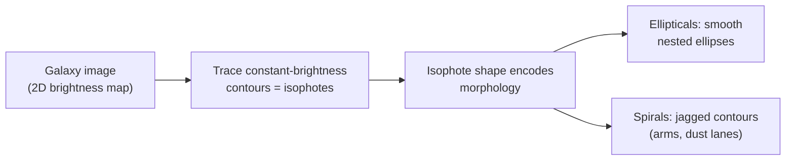

# 03 — Surface Brightness and Isophotes

> Why does an elliptical look like a smooth blob and a spiral look like a pinwheel? The answer lives in **how light is distributed across the galaxy** — its *surface brightness profile* — and in the **contours of constant brightness**, called *isophotes*. These are the quantitative versions of the "it looks smooth" / "it looks lumpy" intuition that a flatten-and-classify baseline can only partly grasp.

> All images linked below come from public NASA / ESA / NOIRLab / SDSS archives. We **link** rather than embed to keep the repo lightweight; click through for full resolution.

---

## From Pixels to Physics

Last week you learned that a CCD pixel records a **count** proportional to the number of photons that landed on it. A galaxy image is therefore a 2D map of brightness. **Surface brightness** is the astronomer's name for that quantity, made precise:

> **Surface brightness** is the amount of light a galaxy emits *per unit area on the sky* — typically magnitudes per square arcsecond.

The crucial and slightly counter-intuitive fact:

> **Surface brightness does not depend on distance.** A more distant galaxy looks *fainter overall* and *smaller*, but each patch of it has the **same** surface brightness as if it were nearby. (Distance dims the total light *and* shrinks the area in exactly the same proportion, so the ratio — brightness per area — is unchanged, ignoring cosmological effects.)

This is why surface brightness is such a useful structural fingerprint: it describes the galaxy's *intrinsic* light distribution, not an accident of how far away it happens to be.

---

## The Surface Brightness Profile `I(r)`

Take a galaxy, find its centre, and ask: *how does brightness change as I walk outward from the centre?* Plotting brightness `I` against radius `r` gives the **surface brightness profile**, `I(r)`.

```
I(r)
 |*                         * = bright centre
 | *
 |  *.                      brightness falls off
 |    *..                   smoothly with radius r
 |       *...
 |           *....
 |                *........
 +----------------------------- r  (distance from centre)
```

Almost all galaxies are **brightest at the centre** and **fade outward**. *How fast* and *in what shape* they fade is what distinguishes the morphological classes:

- **Ellipticals** fall off steeply and smoothly from a concentrated, bright core — a centrally-concentrated profile.
- **Spiral disks** fall off more gently and roughly **exponentially** with radius, with bumps where the arms are.

We'll put a formula to these shapes — the **Sérsic profile** — in [`06-stellar-demographics-and-sersic.md`](06-stellar-demographics-and-sersic.md). For now, the key idea is: *the radial fall-off of light is a measurable, class-dependent signature.*

---

## Isophotes: Contour Lines of Light

An **isophote** is a curve connecting all the points on the image that share the **same surface brightness** — exactly like a contour line on a topographic map joins points of equal altitude.



Text fallback: a galaxy image is a 2D brightness map; tracing curves of constant brightness gives isophotes; the *shape* of those isophotes encodes morphology — smooth nested ellipses for ellipticals, jagged irregular contours for spirals.

### What isophote shapes tell us

| Galaxy type | Isophote appearance | Why |
|---|---|---|
| **Elliptical** | Smooth, concentric, near-perfect **ellipses**, nested like an onion. | Light is smoothly distributed; stars orbit on random paths, averaging into a clean spheroid. |
| **Spiral** | **Jagged and broken** — contours bulge along arms, dip across dust lanes, and are roughly circular in the disk. | Arms are bright ridges, dust lanes are dark gaps; the disk has lumpy ongoing star formation. |
| **Lenticular (S0)** | Smooth ellipses (disk + bulge) but **more elongated** than an elliptical's, with no arm bumps. | A disk exists but there's no spiral structure to break the contours. |
| **Irregular** | Chaotic, asymmetric, no clean centre. | No ordered structure; often mid-merger. |

Professional astronomers fit ellipses to isophotes and measure tiny deviations from perfect ellipses (called "boxy" vs "disky" isophotes) to infer a galaxy's formation history. We won't go that far — but the *concept* is exactly what our eyes (and, eventually, a CNN) latch onto.

---

## Where This Connects to Our ML Baseline

Here is the bridge back to [`02-baseline-with-scikit-learn.md`](02-baseline-with-scikit-learn.md).

A flatten-and-classify model can pick up **gross** surface-brightness cues:

- Ellipticals concentrate their light, so a few central pixels are very bright and the rest dim — a pattern that survives flattening as "high values in some positions, low elsewhere".
- Spirals spread light into a disk and are bluer, giving a different distribution of pixel values.

So the baseline isn't hopeless — surface brightness *statistics* leak through even after you destroy the geometry. But what the baseline **cannot** see is the *shape* of the isophotes — whether the contours are smooth ellipses or broken by arms — because that is inherently spatial. Two galaxies could have nearly identical *histograms* of pixel brightness while one is a smooth elliptical and the other a barred spiral.

> **This is the astrophysical version of the lesson from page 01.** The information that distinguishes morphologies most cleanly — isophote shape, arm curvature, the radial profile's form — lives in the *arrangement* of pixels. Flattening throws the arrangement away. A CNN keeps it. Surface brightness and isophotes are the physics that make that trade-off concrete.

---

## Where to Look

- **M87** — a giant elliptical; its isophotes are textbook smooth nested ellipses. [Hubble image](https://esahubble.org/images/opo0010c/).
- **M51 (Whirlpool)** — a grand-design spiral; trace its isophotes and they bulge dramatically along the two arms. [Hubble image](https://esahubble.org/images/heic0506a/).
- **NGC 1300** — a barred spiral; the bar shows up as an elongated central isophote feeding into the arms. [Hubble image](https://esahubble.org/images/heic0501a/).
- **SDSS SkyServer** — pull up any galaxy and use the tools to inspect its brightness profile yourself: [SkyServer Explore](https://skyserver.sdss.org/).

---

## Quick Self-Check

1. What is surface brightness, and why doesn't it depend on how far away the galaxy is?
2. Sketch (in words) the surface brightness profile `I(r)` of a typical galaxy. Where is it brightest?
3. What is an isophote, and what everyday map feature is it analogous to?
4. How do the isophotes of an elliptical differ from those of a spiral?
5. Which surface-brightness cues *can* a flatten-and-classify baseline pick up, and which can it not? Why?

<details>
<summary>Answers</summary>

1. It's the light emitted per unit area on the sky (e.g. mag/arcsec²). Distance dims the total light and shrinks the apparent area by the same factor, so brightness-per-area stays constant.
2. Brightest at the centre, falling off smoothly with increasing radius `r` — steeply for ellipticals, more gently (roughly exponentially) for spiral disks.
3. A contour connecting points of equal surface brightness; it's analogous to a contour (elevation) line on a topographic map.
4. Ellipticals have smooth, concentric, nearly perfect nested ellipses; spirals have jagged, broken contours that bulge along arms and dip across dust lanes.
5. It can pick up gross statistics like overall brightness, concentration, and colour (which survive flattening), but it cannot see isophote *shape* or arm structure because those are spatial relationships destroyed by flattening.

</details>

---

## External Resources

- 📘 [Wikipedia — Surface brightness](https://en.wikipedia.org/wiki/Surface_brightness) — including the distance-independence argument.
- 📘 [Wikipedia — Isophote](https://en.wikipedia.org/wiki/Isophote).
- 📘 [Caltech — Galaxy photometry and surface brightness profiles (Ay127 notes)](https://www.astro.caltech.edu/~george/ay127/) — the rigorous version.
- 📘 [Las Cumbres Observatory — Spacebook on Galaxies](https://lco.global/spacebook/galaxies/).
- 📄 [Kormendy & Bender 1996 — on boxy vs disky isophotes](https://ui.adsabs.harvard.edu/abs/1996ApJ...464L.119K/abstract) — for the curious; how isophote shape encodes formation history.
- 📺 [Dr. Becky — how astronomers measure galaxies](https://www.youtube.com/@DrBecky) — accessible and accurate.

---

⬅️ Previous: [`02-baseline-with-scikit-learn.md`](02-baseline-with-scikit-learn.md) | ➡️ Next: [`04-building-models-with-nn-module.md`](04-building-models-with-nn-module.md)
