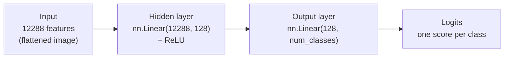
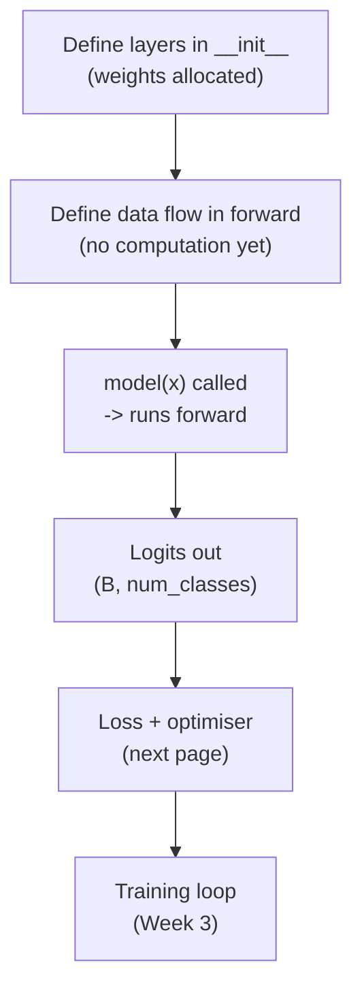

# 04 — Building Models with `nn.Module`

> This is the moment the track has been building toward: writing your **first neural network in PyTorch**. Every model — from this two-layer perceptron to the CNN in Week 3 to a giant transformer — is a subclass of `nn.Module`. Learn the pattern once here and you'll recognise it everywhere.

---

## What a Neural Network *Is* (a 60-Second Recap)

A neural network is a stack of **layers**. Each layer takes a vector of numbers in, multiplies it by a matrix of learnable **weights**, adds a **bias**, and (usually) passes the result through a non-linear **activation function**. Stack a few of these and you have a function with thousands or millions of tunable knobs that can approximate very complicated input→output mappings.

For us:

- **Input:** a flattened galaxy image — a vector of 12 288 numbers.
- **Output:** one score per class (e.g. 3 numbers for 3 morphologies). The biggest score is the predicted class.
- **In between:** one or more **hidden layers** that learn useful intermediate features.

A network with only fully-connected (`nn.Linear`) layers like this is called a **Multi-Layer Perceptron (MLP)**, or a **fully-connected / dense network**.



Text fallback: input of 12 288 features → a hidden `Linear(12288, 128)` layer with ReLU → an output `Linear(128, num_classes)` layer → logits (one score per class).

---

## The `nn.Module` Pattern

Every PyTorch model follows the **same two-method recipe**. You define a class that inherits from `nn.Module` and write:

1. **`__init__`** — *what layers exist.* You create the layers here and store them as attributes. (Always call `super().__init__()` first, or PyTorch won't register your parameters.)
2. **`forward`** — *how data flows through those layers.* You take an input tensor and return the output, calling the layers in order.

```python
import torch
import torch.nn as nn

class GalaxyMLP(nn.Module):
    def __init__(self, in_features=3*64*64, hidden=128, num_classes=3):
        super().__init__()                       # MUST come first
        self.flatten = nn.Flatten()              # (B,3,64,64) -> (B,12288)
        self.fc1 = nn.Linear(in_features, hidden)  # first dense layer
        self.relu = nn.ReLU()                    # non-linearity
        self.fc2 = nn.Linear(hidden, num_classes)  # output layer

    def forward(self, x):                        # x: (B, 3, 64, 64)
        x = self.flatten(x)                      # (B, 12288)
        x = self.fc1(x)                          # (B, 128)
        x = self.relu(x)                         # (B, 128)
        x = self.fc2(x)                          # (B, num_classes)  <- logits
        return x
```

That's a complete, trainable neural network. Two things to internalise:

- **`__init__` defines; `forward` runs.** Creating a layer in `__init__` doesn't process any data — it just allocates the weights. The actual computation happens in `forward`, every time you call the model.
- **You never call `forward` directly.** You call the model *instance* like a function — `model(x)` — and PyTorch routes it through `forward` (plus some bookkeeping). Calling `model.forward(x)` directly skips that bookkeeping; don't do it.

```python
model = GalaxyMLP(num_classes=3)
batch = torch.randn(32, 3, 64, 64)   # a fake batch shaped like our data
logits = model(batch)                # calls forward under the hood
print(logits.shape)                  # torch.Size([32, 3])
```

---

## `nn.Linear`: The Workhorse Layer

`nn.Linear(in_features, out_features)` implements the classic affine transform:

```
output = input @ Wᵀ + b
```

- `W` is a learnable weight matrix of shape `(out_features, in_features)`.
- `b` is a learnable bias vector of shape `(out_features,)`.
- Both are created and initialised **automatically** when you construct the layer — you never fill them in by hand.

```python
layer = nn.Linear(12288, 128)
print(layer.weight.shape)   # torch.Size([128, 12288])
print(layer.bias.shape)     # torch.Size([128])
```

> **Shapes are everything.** The `out_features` of one layer must equal the `in_features` of the next. Here `fc1` outputs 128, so `fc2` must take 128 in. Get this wrong and you'll see a shape-mismatch `RuntimeError` — print your shapes and the bug is obvious. Roughly 80% of "my model won't run" issues are shape bugs.

### Why we need `nn.ReLU` (the non-linearity)

Stacking two `Linear` layers with **nothing** between them is mathematically equivalent to a *single* linear layer — the composition of two linear maps is still linear. To get the expressive power of "deep" learning, you must insert a **non-linear activation** between layers.

**ReLU** (Rectified Linear Unit) is the standard default:

```
ReLU(x) = max(0, x)      # keep positives, zero out negatives
```

It's cheap, it works, and it's what you should reach for first. Its job is simply to bend the function so the network can represent curves and corners, not just flat hyperplanes.

> **Important: no activation on the final layer.** The output layer (`fc2`) returns raw scores called **logits** — *not* probabilities. We deliberately do **not** apply a softmax or ReLU here, because the loss function we use next (`nn.CrossEntropyLoss`) expects raw logits and applies the softmax internally. This trips up almost everyone once; see [`05-loss-functions-and-optimisers.md`](05-loss-functions-and-optimisers.md).

---

## Inspecting Your Model

PyTorch makes a model introspectable. `print(model)` shows the architecture; iterating over `.parameters()` shows the learnable tensors.

```python
print(model)
# GalaxyMLP(
#   (flatten): Flatten(start_dim=1, end_dim=-1)
#   (fc1): Linear(in_features=12288, out_features=128, bias=True)
#   (relu): ReLU()
#   (fc2): Linear(in_features=128, out_features=3, bias=True)
# )

total = sum(p.numel() for p in model.parameters())
trainable = sum(p.numel() for p in model.parameters() if p.requires_grad)
print(f"Total parameters     : {total:,}")
print(f"Trainable parameters : {trainable:,}")
```

For our little MLP the parameter count is dominated by `fc1`: `12288 × 128 + 128 ≈ 1.57 million` weights in that one layer. That huge number is a direct consequence of flattening — every pixel connects to every hidden unit. A CNN (Week 3) achieves *more* with *far fewer* parameters by sharing weights across the image. Worth noticing now; it'll click in Week 3.

---

## Moving the Model to the GPU

Just like tensors, a model lives on a device. Call `.to(device)` on the model, and make sure your input batch is on the **same** device.

```python
device = "cuda" if torch.cuda.is_available() else "cpu"
model = GalaxyMLP(num_classes=3).to(device)

batch = batch.to(device)        # input must match the model's device
logits = model(batch)
print(logits.device)            # cuda:0
```

> **The #1 device error:** `RuntimeError: Expected all tensors to be on the same device`. It means your model is on the GPU but a batch (or vice versa) is on the CPU. Fix: `.to(device)` both the model (once) and every input batch (each iteration).

---

## The Mental Model

Tie it together:



Text fallback: define layers in `__init__` → define the data path in `forward` → calling `model(x)` runs `forward` and produces logits → a loss and optimiser turn those logits into a learning signal (next page) → the full training loop arrives in Week 3.

This week's deliverable stops at **"the model forward-passes a batch without errors and prints its architecture"**. We're verifying the *plumbing*. Actually *training* it — running data through repeatedly so the weights improve — is Week 3, once we have the training loop.

---

## Common Pitfalls

| Symptom | Cause | Fix |
|---|---|---|
| `... parameters ... empty` / model won't train | Forgot `super().__init__()` in `__init__`. | Call it as the very first line. |
| Shape-mismatch `RuntimeError` in `forward` | `out_features` of one layer ≠ `in_features` of the next, or forgot to flatten. | Print shapes after each layer; flatten `(B,3,64,64)` to `(B,12288)` first. |
| Output is `(B, 3, 64, 64)`-ish, not `(B, num_classes)` | No `Flatten` before the first `Linear`. | Add `nn.Flatten()` (or `x.flatten(start_dim=1)`). |
| `Expected all tensors to be on the same device` | Model and batch on different devices. | `.to(device)` both. |
| Network won't learn anything later | No non-linearity between Linear layers, so it's effectively one layer. | Insert `nn.ReLU()` between them. |
| Probabilities look wrong / loss misbehaves | Applied softmax on the output layer. | Return raw logits; let `CrossEntropyLoss` handle softmax. |

---

## Quick Self-Check

1. What two methods must every `nn.Module` subclass define, and what is each responsible for?
2. Why must `super().__init__()` be the first line of your `__init__`?
3. You stack `Linear(12288, 64)` then `Linear(64, 3)`. Why does the `64` have to match?
4. Why do we put a `ReLU` between the two linear layers but **not** after the last one?
5. Should you call `model(x)` or `model.forward(x)`? Why?

<details>
<summary>Answers</summary>

1. `__init__` (defines which layers exist and allocates their weights) and `forward` (defines how an input tensor flows through those layers to produce the output).
2. It runs `nn.Module`'s setup that registers your layers' parameters; skip it and PyTorch won't track your weights, so the model can't be trained or moved to a device correctly.
3. The first layer outputs 64 features, so the second must accept 64 input features — the `out_features` of one layer must equal the `in_features` of the next.
4. ReLU between them adds the non-linearity that makes stacking layers meaningful (otherwise two linear layers collapse to one); the last layer must stay raw because we want logits, and `CrossEntropyLoss` applies the softmax itself.
5. Call `model(x)`; it runs `forward` plus PyTorch's hook/bookkeeping machinery. Calling `forward` directly skips that and can cause subtle bugs.

</details>

---

## External Resources

- 📘 [PyTorch — Build the Neural Network (official tutorial)](https://docs.pytorch.org/tutorials/beginner/basics/buildmodel_tutorial.html).
- 📘 [`torch.nn.Module` docs](https://docs.pytorch.org/docs/stable/generated/torch.nn.Module.html) and [`torch.nn.Linear` docs](https://docs.pytorch.org/docs/stable/generated/torch.nn.Linear.html).
- 📘 [`torch.nn` overview — all the building blocks](https://docs.pytorch.org/docs/stable/nn.html).
- 📘 [PyTorch — `nn.ReLU` and other activations](https://docs.pytorch.org/docs/stable/nn.html#non-linear-activations-weighted-sum-nonlinearity).
- 📺 [3Blue1Brown — But what is a neural network?](https://www.youtube.com/watch?v=aircAruvnKk) — the canonical visual intuition.
- 📺 [Daniel Bourke — PyTorch `nn.Module` walkthrough](https://www.learnpytorch.io/02_pytorch_classification/) — beginner-friendly, free.
- 📘 [The Universal Approximation Theorem (Wikipedia)](https://en.wikipedia.org/wiki/Universal_approximation_theorem) — why a non-linearity makes MLPs powerful.

---

⬅️ Previous: [`03-surface-brightness-and-isophotes.md`](03-surface-brightness-and-isophotes.md) | ➡️ Next: [`05-loss-functions-and-optimisers.md`](05-loss-functions-and-optimisers.md)
