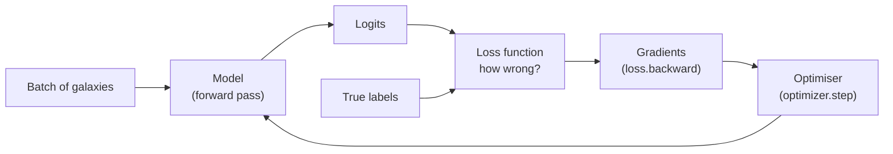

# 05 — Loss Functions and Optimisers

> A model that forward-passes a batch is just a fancy random-number generator until you tell it **how wrong it is** (the *loss*) and **how to get less wrong** (the *optimiser*). These are the two ingredients that turn a static `nn.Module` into something that *learns*. We set them up this week; we put them to work in the Week-3 training loop.

---

## The Learning Loop in One Picture

Training a neural network is a feedback loop:



Text fallback: a batch goes through the model to produce logits; the loss function compares logits to true labels and produces a single "how wrong" number; backpropagation turns that into gradients; the optimiser uses the gradients to nudge the weights; repeat. This page covers the **loss** and the **optimiser** boxes. The full loop is Week 3.

---

## Loss Functions: Measuring "How Wrong"

A **loss function** takes the model's predictions and the true labels and returns a **single scalar** — bigger means more wrong. Training is, mathematically, the search for weights that make this scalar as small as possible.

For **classification** (our task: which morphology?), the standard choice is **cross-entropy loss**.

### Logits → probabilities → loss

Recall from [`04-building-models-with-nn-module.md`](04-building-models-with-nn-module.md) that the model's output layer produces **logits** — raw, unbounded scores, one per class. Cross-entropy turns these into a loss in two conceptual steps:

1. **Softmax** squashes the logits into probabilities that are all positive and sum to 1.

```
softmax(z)_i = exp(z_i) / Σ_j exp(z_j)
```

2. **Negative log-likelihood** then penalises the model by how *little* probability it assigned to the *correct* class:

```
loss = -log( probability assigned to the true class )
```

If the model is confident and right, the true-class probability is near 1, `-log(1) = 0` → tiny loss. If it's confident and *wrong*, the true-class probability is near 0, `-log(small) =` huge → big loss. That asymmetry is exactly what we want: it punishes confident mistakes hardest.

### `nn.CrossEntropyLoss` does both steps for you

This is the single most common beginner trip-wire, so read it twice:

> **`nn.CrossEntropyLoss` applies the softmax *internally*.** You feed it **raw logits**, not probabilities. Do **not** put a `Softmax` (or `ReLU`) on your model's output layer. If you softmax first and then pass it in, you'll softmax twice and your training will be subtly broken.

```python
import torch
import torch.nn as nn

criterion = nn.CrossEntropyLoss()

logits = model(batch)            # raw logits, shape (B, num_classes)
loss = criterion(logits, labels) # labels: shape (B,), dtype torch.long
print(loss.item())               # a single float, e.g. 1.0986
```

Two requirements on the inputs:

| Argument | Required shape | Required dtype |
|---|---|---|
| `logits` (predictions) | `(B, num_classes)` | float |
| `labels` (targets) | `(B,)` — *class indices*, not one-hot | `torch.long` (int64) |

> **Sanity check your starting loss.** For `C` balanced classes, an *untrained* model should produce a loss near `ln(C)`. For 3 classes that's `ln(3) ≈ 1.0986`. If your initial loss is wildly different (or `nan`), something is wrong — usually wrong label dtype, double-softmax, or unnormalised inputs.

---

## Optimisers: Getting Less Wrong

The loss tells you *how* wrong. **Backpropagation** (`loss.backward()`) computes the **gradient** of the loss with respect to every weight — i.e. for each weight, "which direction, and how much, would nudging it reduce the loss?". The **optimiser** is what actually takes that gradient and updates the weights.

The simplest optimiser is **gradient descent**: step every weight a little bit in the direction that lowers the loss.

```
weight ← weight − learning_rate × gradient
```

The **learning rate** is the step size — the single most important hyperparameter you'll set.

### Adam: the sensible default

Plain gradient descent works but can be slow and fiddly. **Adam** (Adaptive Moment Estimation) is an improved optimiser that adapts the step size per-parameter and uses momentum to smooth the path. It is the standard "just works" choice for beginners and most projects.

```python
import torch.optim as optim

optimizer = optim.Adam(model.parameters(), lr=1e-3)
```

Two things to notice:

- **`model.parameters()`** hands the optimiser the exact tensors to update — this is *why* registering parameters via `nn.Module` (and `super().__init__()`) matters.
- **`lr=1e-3` (0.001)** is Adam's classic default and a great starting point. Too high and the loss diverges or oscillates; too low and training crawls.

| Optimiser | When to use | Notes |
|---|---|---|
| `optim.SGD` | When you want full control / are reproducing a paper. | Needs careful LR + momentum tuning. |
| `optim.Adam` | **Default for this track.** | Robust, adapts step sizes, forgiving of LR. |
| `optim.AdamW` | Adam + cleaner weight decay. | Common in modern code; fine to use. |

---

## The Three Lines That Make Learning Happen

Every PyTorch training iteration is built around these three calls, in this order:

```python
optimizer.zero_grad()   # 1. clear gradients left over from the last step
loss.backward()         # 2. compute new gradients (backpropagation)
optimizer.step()        # 3. update the weights using those gradients
```

Why each one, and why the order:

1. **`zero_grad()`** — PyTorch *accumulates* gradients by default (it adds new gradients onto whatever is already stored). If you forget to zero them, gradients from previous batches pile up and corrupt the update. This is the most common silent training bug.
2. **`loss.backward()`** — walks the computation graph backward, filling in `.grad` for every parameter.
3. **`optimizer.step()`** — applies the update rule (e.g. Adam's) using those `.grad` values.

> This week we **set up** `criterion` and `optimizer` and maybe run these three lines on a *single* batch to prove they work. Running them over **all** batches for **several epochs** — the actual training loop — is the headline of Week 3. We're laying the last piece of track before the train arrives.

---

## A Single-Batch Sanity Step (Preview)

You can verify the whole machine moves with one batch:

```python
model.train()                          # training mode
images, labels = next(iter(train_loader))
images, labels = images.to(device), labels.to(device)

logits = model(images)                 # forward
loss = criterion(logits, labels)       # how wrong
print("loss before step:", loss.item())

optimizer.zero_grad()                  # clear
loss.backward()                        # gradients
optimizer.step()                       # update

logits2 = model(images)                # forward again on same batch
print("loss after step :", criterion(logits2, labels).item())
```

If the second loss is **lower** than the first, congratulations — your model just learned something from one batch. That's the entire principle of deep learning, in miniature.

---

## Common Pitfalls

| Symptom | Cause | Fix |
|---|---|---|
| Loss is `nan` or enormous from step 1 | Labels not `torch.long`, or inputs unnormalised, or LR way too high. | Cast labels to `long`; keep Week-1 `Normalize`; try `lr=1e-3`. |
| Loss won't go down at all | Forgot `optimizer.zero_grad()`, or LR too small, or model/data on different devices. | Add `zero_grad()`; raise LR; `.to(device)` everything. |
| Loss oscillates wildly / diverges | Learning rate too high. | Lower it (e.g. `1e-3` → `3e-4`). |
| `RuntimeError` about softmax / shapes from the loss | Applied softmax on the output layer, or wrong logits/label shapes. | Return raw logits; logits `(B,C)`, labels `(B,)`. |
| Initial loss isn't near `ln(num_classes)` | Double-softmax or label/logit mismatch. | Check you pass raw logits and integer class indices. |

---

## Quick Self-Check

1. What does a loss function output, and what does "minimising it" mean?
2. Why must you pass **raw logits** (not softmaxed probabilities) to `nn.CrossEntropyLoss`?
3. What dtype and shape must the labels have for `CrossEntropyLoss`?
4. What's a reasonable starting loss for an untrained model on 4 balanced classes?
5. What do `optimizer.zero_grad()`, `loss.backward()`, and `optimizer.step()` each do, and why must `zero_grad` come first?

<details>
<summary>Answers</summary>

1. A single scalar measuring how wrong the predictions are; minimising it means searching for weights that make the predictions match the labels as closely as possible.
2. Because `CrossEntropyLoss` applies softmax internally; passing already-softmaxed values softmaxes twice and breaks the loss.
3. `torch.long` (int64), shape `(B,)` — integer class indices, not one-hot vectors.
4. About `ln(4) ≈ 1.386`.
5. `zero_grad()` clears accumulated gradients, `backward()` computes new gradients, `step()` updates the weights; `zero_grad` must come first because PyTorch *adds* new gradients onto existing ones, so leftover gradients from the previous batch would corrupt this step.

</details>

---

## External Resources

- 📘 [PyTorch — `nn.CrossEntropyLoss` docs](https://docs.pytorch.org/docs/stable/generated/torch.nn.CrossEntropyLoss.html) (note the "expects unnormalized logits" line).
- 📘 [PyTorch — Optimization tutorial (loss + optimizer + loop)](https://docs.pytorch.org/tutorials/beginner/basics/optimization_tutorial.html).
- 📘 [`torch.optim` docs](https://docs.pytorch.org/docs/stable/optim.html) — every optimiser and its arguments.
- 📄 [Kingma & Ba 2014 — Adam: A Method for Stochastic Optimization (arXiv)](https://arxiv.org/abs/1412.6980) — the original Adam paper.
- 📺 [3Blue1Brown — Gradient descent, how neural networks learn](https://www.youtube.com/watch?v=IHZwWFHWa-w).
- 📺 [StatQuest — Cross Entropy clearly explained](https://www.youtube.com/watch?v=6ArSys5qHAU).
- 📘 [CS231n notes — losses and optimisation](https://cs231n.github.io/optimization-1/) — thorough and free.

---

⬅️ Previous: [`04-building-models-with-nn-module.md`](04-building-models-with-nn-module.md) | ➡️ Next: [`06-stellar-demographics-and-sersic.md`](06-stellar-demographics-and-sersic.md)
