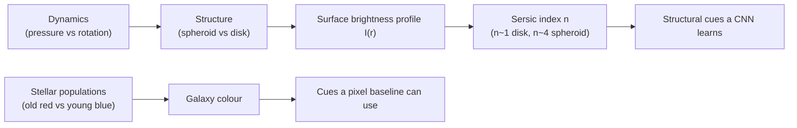

# 06 — Stellar Demographics and the Sérsic Profile

> Why is an elliptical galaxy "red and dead" while a spiral glows blue? And can we put a single number on "how concentrated is this galaxy's light"? This page connects the **populations of stars** inside a galaxy to its colour, and introduces the **Sérsic profile** — the one equation that turns the surface-brightness curve from [`03-surface-brightness-and-isophotes.md`](03-surface-brightness-and-isophotes.md) into a measurable index.

> Images are **linked** from public NASA / ESA / NOIRLab / SDSS archives, not embedded.

---

## Stellar Demographics: A Galaxy Is a Population

A galaxy isn't one kind of star — it's a *demographic mix* of billions of stars of different masses, ages, and colours. The mix sets the galaxy's overall colour and explains the Hubble sequence at a physical level.

The single most important fact about stars for our purposes:

> **Massive stars are blue, hot, luminous, and short-lived. Low-mass stars are red, cool, faint, and extremely long-lived.**

A massive blue star burns through its fuel in a few million years; a small red star lives for many billions. So the colour of a galaxy is a clock and a census at once:

- **Lots of blue light** → there must be massive stars → those stars are young → the galaxy is **forming stars right now** → it still has cold gas.
- **Mostly red/yellow light** → the blue stars have long since died → only the old, long-lived red stars remain → star formation has **stopped** → the gas is used up or gone.

### Ellipticals: "red and dead"

```
Ellipticals
├── Old stellar population (mostly low-mass red stars)
├── Very little cold gas → almost no new star formation
├── Pressure-supported (random orbits) → smooth spheroid
└── Net colour: red / yellow
```

Ellipticals had their star-forming heyday long ago — often in an ancient merger that consumed the gas in a burst. What's left is a quietly ageing population of red stars. Astronomers call them **"red and dead"**: red in colour, dead in star formation.

### Spirals: blue, gas-rich, alive

```
Spirals
├── Mixed population: old red bulge + young blue disk
├── Plenty of cold gas → ongoing star formation in the arms
├── Rotation-supported → thin disk with spiral structure
└── Net colour: blue disk, redder bulge
```

The blue knots and pink patches tracing a spiral's arms are **young massive stars and the gas they're ionising** (H II regions — more in Week 3). The arms look blue precisely *because* that's where new stars are being born. The central bulge, made of older stars, is redder.

| Property | Elliptical | Spiral |
|---|---|---|
| Dominant stars | Old, low-mass, red | Mix: old bulge + young blue disk |
| Cold gas | Little | Plenty |
| Star formation | Quenched ("dead") | Ongoing |
| Net colour | Red / yellow | Blue (disk) |
| Support | Pressure (random orbits) | Rotation (ordered disk) |
| Light profile | Steep, concentrated | Shallower, exponential disk |

> **Why our baseline picks up *some* signal.** Colour is a per-pixel property that *survives flattening* — a redder average pixel hints "elliptical", a bluer one hints "spiral". That's why KNN and logistic regression (page 02) aren't useless. But colour alone is crude: edge-on dusty spirals look red, and some ellipticals have a little blue light. The *reliable* discriminators are structural — concentration and isophote shape — and those need the spatial reasoning a CNN provides.

---

## The Sérsic Profile: One Number for "Concentration"

Page 03 showed that galaxies are brightest in the centre and fade outward, and that the *shape* of that fade differs by type. The **Sérsic profile** (Sérsic 1963) is the standard mathematical model of that fade:

```
I(r) = I_e · exp( −b_n · [ (r / R_e)^(1/n) − 1 ] )
```

Don't be intimidated — the only symbol you need to care about is **`n`, the Sérsic index**:

- `I(r)` — surface brightness at radius `r`.
- `R_e` — the **effective radius**, the radius containing half the galaxy's total light.
- `I_e` — the surface brightness at `R_e`.
- `b_n` — a constant chosen so `R_e` really is the half-light radius (it depends on `n`).
- **`n` — the Sérsic index: how *centrally concentrated* the light is.** This is the headline.

A common shorthand is to write the exponent as `r^(1/n)`: small `n` → light falls off gently; large `n` → a sharp bright spike in the middle with an extended faint envelope.

### What the index `n` tells you

```
I(r)
 |  n=4 (elliptical): sharp central spike, long faint wings
 |\
 | \      n=1 (disk): gentle exponential fall-off
 |  \____
 |   \   \____
 |    \       \________
 +-------------------------- r
```

| Sérsic index `n` | Profile shape | Typical galaxy | Special name |
|---|---|---|---|
| **`n ≈ 1`** | Exponential — gentle fall-off | **Spiral disk** (disk-dominated) | "Exponential profile" |
| **`n ≈ 4`** | Steep core + extended faint halo | **Elliptical / bulge** (bulge-dominated) | "de Vaucouleurs profile" |
| `0.5 ≲ n ≲ 10` | Continuum in between | Lenticulars, mixed bulge+disk systems | — |

So the Sérsic index is a **single scalar that captures morphology's most basic axis**: disk-like (`n ≈ 1`) vs spheroid-like (`n ≈ 4`). Two famous historical profiles are just special cases — `n = 1` is the exponential disk, `n = 4` is the de Vaucouleurs law that fit ellipticals for decades before Sérsic generalised them.

> **The deep point for ML.** A human astronomer can compress an entire galaxy's structure into a couple of physically-meaningful numbers — Sérsic index `n`, effective radius `R_e`, colour, ellipticity — by *fitting a model*. A flatten-and-classify baseline gets 12 288 raw, meaningless-to-it pixels instead. A CNN sits between these worlds: it *learns* its own features from the raw pixels, and those learned features often turn out to resemble exactly the structural cues (concentration, arm presence, smoothness) that `n` and isophotes formalise. That's why, in Week 3, a CNN's mistakes will mirror genuinely ambiguous astrophysics — like telling a high-`n` lenticular from an elliptical.

---

## Tying the Week Together



Text fallback: stellar populations set a galaxy's colour; dynamics (pressure- vs rotation-support) set its structure; structure shapes the surface-brightness profile `I(r)`; that profile is summarised by the Sérsic index `n` (≈1 disk, ≈4 spheroid). Colour gives cues a flat pixel baseline can exploit; the structural index `n` represents the kind of cue a CNN learns to recover.

---

## Where to Look

- **M87** — giant elliptical, `n ≈ 4`-ish, smooth and red. [Hubble image](https://esahubble.org/images/opo0010c/).
- **M101 (Pinwheel)** — face-on spiral, blue gas-rich disk (`n ≈ 1`) with a redder bulge. [Hubble image](https://esahubble.org/images/heic0602a/).
- **NGC 5866** — edge-on lenticular: intermediate structure, little star formation. [Hubble image](https://esahubble.org/images/heic0604a/).
- **SDSS SkyServer** — many SDSS galaxies come with catalogued Sérsic fits; explore them at [SkyServer](https://skyserver.sdss.org/).

---

## Quick Self-Check

1. Why is a blue galaxy almost certainly forming stars right now, while a red one probably isn't?
2. What does "red and dead" mean, and which galaxy class does it describe?
3. In the Sérsic profile, what does the index `n` measure?
4. What kind of galaxy has `n ≈ 1`? What kind has `n ≈ 4`? What are these two special cases historically called?
5. Why does *colour* help a flatten-and-classify baseline, while *concentration / isophote shape* mostly does not?

<details>
<summary>Answers</summary>

1. Blue light requires massive stars, which are short-lived, so their presence means stars formed very recently (and cold gas is available). A red galaxy's blue stars have died, leaving only old red stars — so star formation has stopped.
2. "Red and dead" means red in colour (old stars) and dead in star formation (no new stars); it describes elliptical galaxies.
3. How centrally concentrated the galaxy's light is — the shape of the surface-brightness fall-off.
4. `n ≈ 1` is a spiral disk (exponential profile); `n ≈ 4` is an elliptical/bulge (de Vaucouleurs profile).
5. Colour is a per-pixel value that survives flattening, so a pixel-based model can use average colour; concentration and isophote shape are spatial relationships that flattening destroys, so only a spatially-aware model (CNN) can use them well.

</details>

---

## External Resources

- 📘 [Wikipedia — Sérsic profile](https://en.wikipedia.org/wiki/Sersic_profile) — with plots of different `n`.
- 📘 [Wikipedia — de Vaucouleurs' law](https://en.wikipedia.org/wiki/De_Vaucouleurs%27s_law) (the `n = 4` special case).
- 📘 [Wikipedia — Stellar classification](https://en.wikipedia.org/wiki/Stellar_classification) — the blue-massive / red-low-mass relationship.
- 📘 [Las Cumbres Observatory — Spacebook: the lives of stars](https://lco.global/spacebook/stars/) and [galaxies](https://lco.global/spacebook/galaxies/).
- 📄 [Graham & Driver 2005 — A concise reference to the Sérsic model (arXiv)](https://arxiv.org/abs/astro-ph/0503176) — the go-to summary of `R_e`, `b_n`, and `n`.
- 📺 [PBS Space Time — Why are galaxies different colours?](https://www.youtube.com/@pbsspacetime) — accessible take on stellar populations.
- 📺 [Dr. Becky — red and dead galaxies](https://www.youtube.com/@DrBecky).

---

⬅️ Previous: [`05-loss-functions-and-optimisers.md`](05-loss-functions-and-optimisers.md) | ➡️ Next: [`07-project-task.md`](07-project-task.md)
